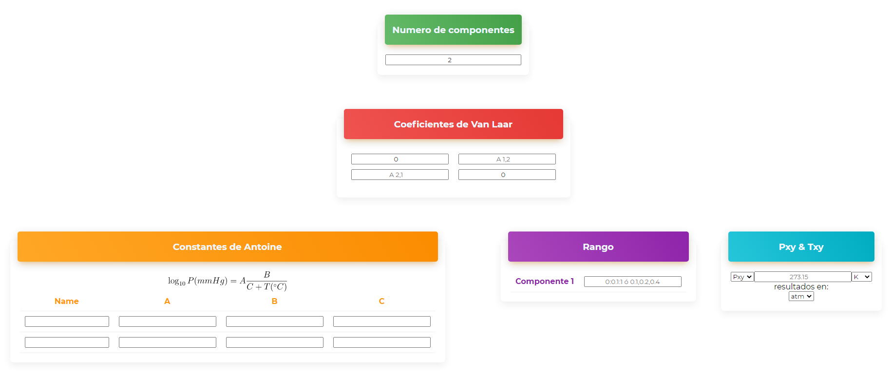
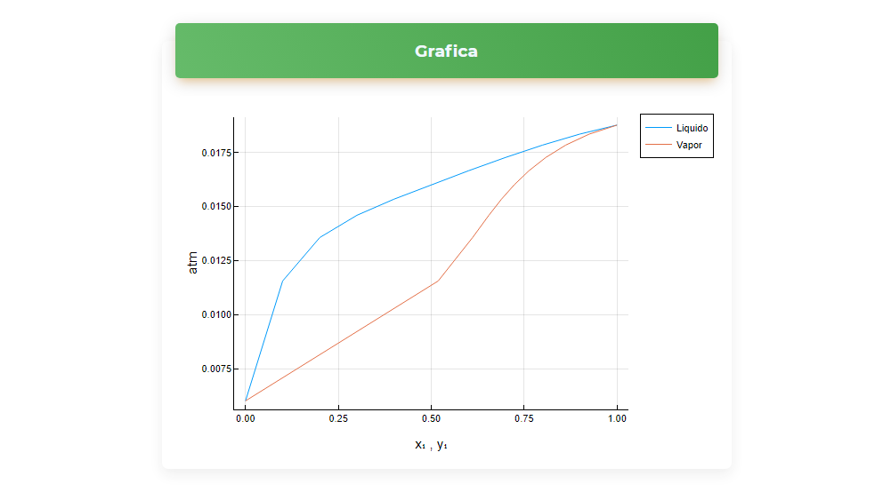
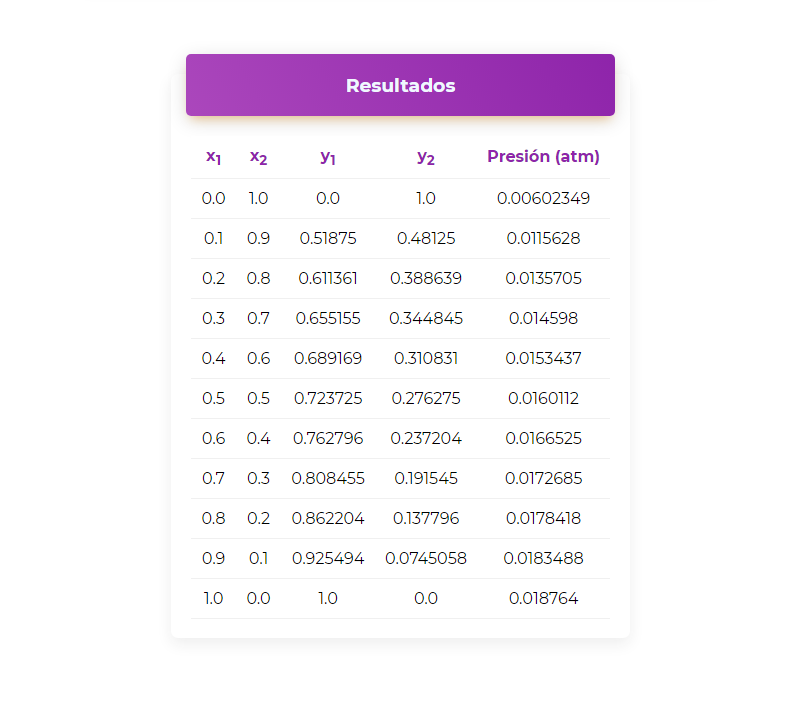
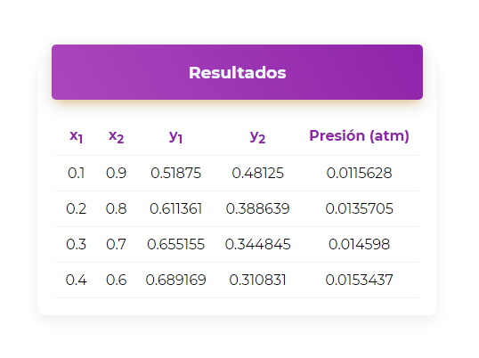

# Guia de usuario

---

```@meta
CurrentModule = TaylorSeries
```

**TermoQuímica** es una pagina de apoyo para ayudar a realizar distintos tipos de cálculos útiles en la ingeniería química; En esta sección de la documentación, usted aprenderá como usar TermoQuímica, y descubrirá todo lo que puede hacer con ella durante un corto, pero divertido tutorial.

Ahora, trataremos de resolver el siguiente problema.

Elabore el diagrama **P-X-Y** para la mezcla **etanol(1)-agua(2)** a 273.15 K, usando el modelo de actividad de **Van Laar**; Para este ejercicio, las coeficientes de Van Laar son: `A12 = 1.6798` y `A21 = 0.9227`, las constantes de Antoine para el etanol son: `A = 8.12875`, `B = 1660.8713`, `C = 238.131` y para el agua `A = 8.05573`, `B = 1723.6425`, `C = 233.08`

Lo primero que debemos hacer es hacer click en la pestaña de métodos y seleccionar Liquido/Vapor, escoger nuestro modelo que en este caso es Van Laar, después de hacer esto, aparecerá la siguiente pantalla, en la cual nos pide el numero de componentes, nuestra mezcla tiene dos componentes asi que ponemos 2 y damos a enviar.


Aparecerá la siguiente pantalla, la cual requiere que introduzcamos los distintos parámetros del modelo, que para el caso de Van Laar son los coeficientes, las constantes de Antoine, el rango en el que queremos evaluar la composición del componente 1, la temperatura y el tipo de diagrama, en este caso P-X-Y.



Habra que rellenar todos los campos y enviarlos.

!!! nota 
    Tenga en cuenta que para seleccionar un rango apropiado la sintaxis es `inicio:paso:fin` donde inicio y fin debe estar entre cero y uno. Para un sistema multicomponente los rangos deben ser iguales para todas las componentes, por ejemplo para una mezcla ternaria estos podrían ser los rangos

    componente 1 -> `0:0.05:1`

    componente 2 -> `0:0.05:1`


Una vez enviados los datos, se desplegaran los resultados en forma gráfica y en forma tabular (la forma gráfica solo se muestra para sistemas de dos o tres componentes), como se muestra en las siguientes imágenes.




Al ver los resultados podríamos querer un numero mayor de puntos a calcular, para hacerlo, solo damos atrás en el navegador y cambiamos el rango del componente 1 de `0:0.1:1` a `0:0.01:1`.


Y listo, ya tendríamos una gráfica mas bonita 🎉.


No solo eso podemos hacer, si en algún momento necesitáramos información acerca de puntos específicos, lo único que tenemos que hacer es escribirlos separados por una coma, de acuerdo con la imagen siguiente. 


